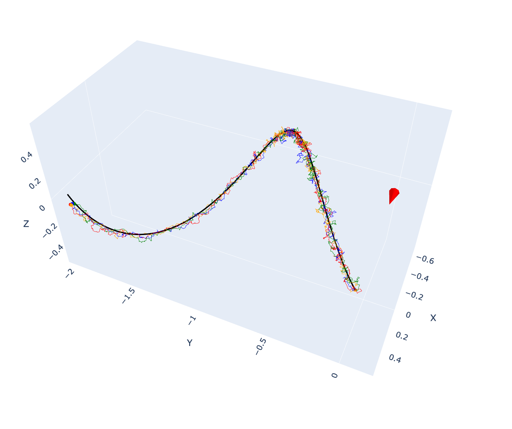
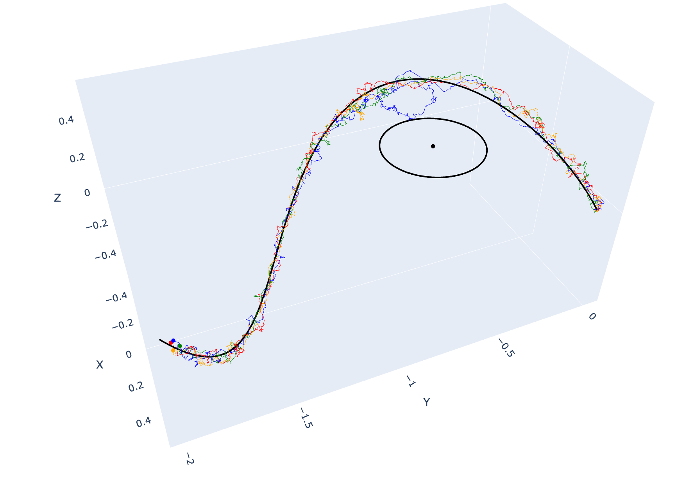
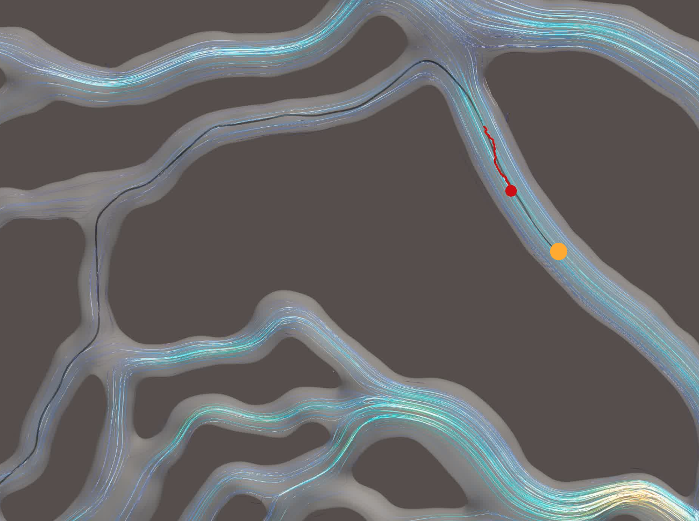

# Micro-Swimmer Control using Deep Reinforcement Learning - 3D

This repository contains the **3D training and evaluation** part of the project.  
It extends the approach developed in the [**2D repository**](https://github.com/lauraachoquett/microswimmer_internship); for detailed explanations of the method and implementation, please refer there.

##  Reinforcement Learning environment

### State

- $\mathbf{X}$ : Position in local frame (w.r.t. the closest path point)
- $\mathbf{V}$ : Velocity in local frame (optional)
- $\mathbf{P}$ : Previous action
- Lookahead : List of the positions and velocities (optional) of the n points following the closest point along the path.

Positions and velocities are expressed in the same local frame, whereas the previous action is provided in the last computed local frame.
### Action 

- Direction $\mathbf{P}$ (2D vector of unit norm)

### Reward 

$$
r_t = -C \cdot \Delta t_{\text{sim}} - \|x_t - x_{\text{target}}\| + \|x_{t-1} - x_{\text{target}}\| - \beta \cdot d
$$

Where:

- $x_{\text{target}}$ : Target position  
- $d$ : Distance to closest point on the path  
- $C \ (m.s^{-1}), \beta$ : Constant weights

## Result on generic path

* Evaluation uniform background velocity with $\mathbf{u} =0.5 \cdot (1, 0, 0)$

    
     
    <i>Figure - Agent evaluation on helix with counter clockwise rotation and uniform background velocity </i>

* Evaluation rankine vortex 

    
     
    <i>Figure - Agent evaluation on helix with counter clockwise rotation and uniform background velocity </i>

## A* 
The algorithm is similar in 3D 

### Result for the retina capillaries

    
     
    <i>Illustrative example in 3D of an agent shown in red, with its 20 previous positions forming a tail indicated by a red solid line. The target point is represented by an orange dot, the path by a black solid line. Streamlines are colored according to the velocity magnitude. (Visualization performed with paraview) </i>

